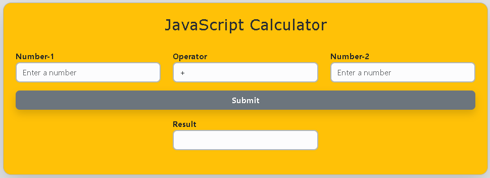
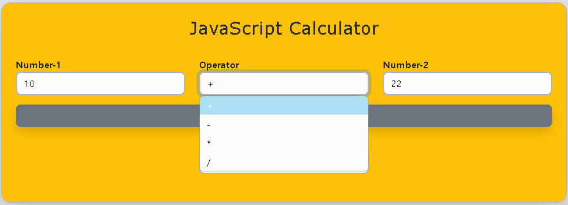
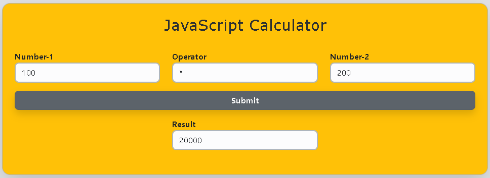
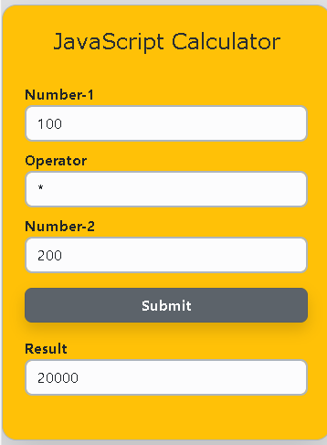
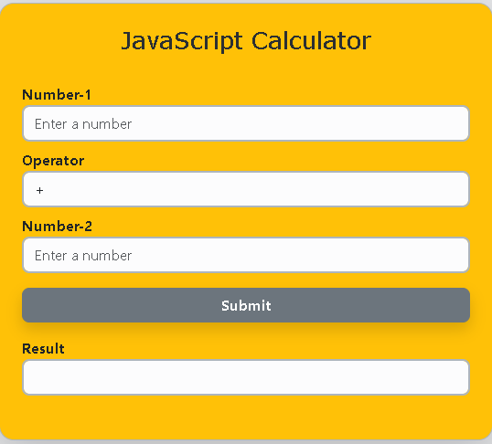

# JavaScript Calculator

## Table of Contents

- [Introduction](#introduction)
- [Features](#features)
- [Installation](#installation)
- [Usage](#usage)
- [Screenshots](#screenshots)
- [License](#license)
- [Additional Information](#additional-information)

## Introduction

This HTML project uses JavaScript for functionality and Bootstrap for styling to create a basic calculator. Users can enter two numbers into the calculator and choose an operator from a drop-down menu. The code computes the result depending on the selected operator and displays it in a read-only text field when the "Submit" button is clicked.

## Features

- Addition, subtraction, multiplication, and division operations.
- Responsive and attractive interface using Bootstrap.
- Input validation to ensure all required fields are filled out before calculations.

## Installation

1. Clone the repository: `git clone https://github.com/nknithi/javascript-calculator.git`
2. Open `index.html` in your web browser.

## Usage

1. Enter the first number in the "Number-1" input field.
2. Select an operator from the dropdown menu.
3. Enter the second number in the "Number-2" input field.
4. Click the "Submit" button to see the result.

## Screenshots

  

  

  

  

  

## License

This project is not licensed.

## Additional Information

- Created by Nithya
- Contact:  [nknithi2018@gmail.com](mailto:nknithi2018@gmail.com).
